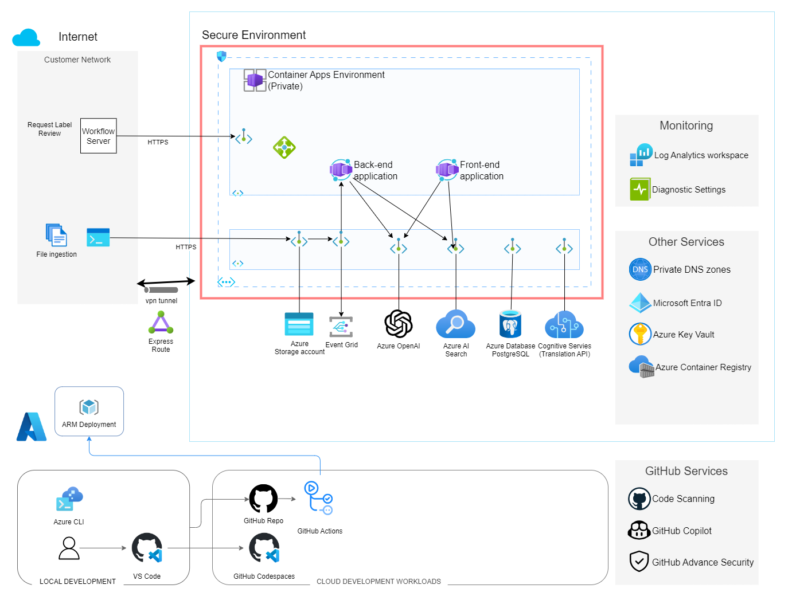

# PDF File Evaluation

Sample project using a workflow and OpenAI API to evaluate PDF files.



# Getting Started

Configure the environment variables. Copy `example.env` to `.env` and update the values

## Create System Identities

The solution use system identities to deploy cloud resources. The following table lists the system identities and their purpose.

| System Identities      | Authentication                                             | Authorization                                                                                                                                                                  | Purpose                                                                                                          |
| ---------------------- | ---------------------------------------------------------- | ------------------------------------------------------------------------------------------------------------------------------------------------------------------------------ | ---------------------------------------------------------------------------------------------------------------- |
| `env.CICD_CLIENT_NAME` | OpenId Connect (OIDC) based Federated Identity Credentials | Subscription Contributor access<br>Microsoft Graph API admin consent Permissions: <ul><li>Directory.ReadWrite.All</li><li>User.Invite.All</li><li>User.ReadWrite.All</li></ul> | Deploy cloud resources: <ul><li>connectivity resources</li><li>Common resources</li></ul><br>Build Docker Images |

```bash
# Configure the environment variables. Copy `example.env` to `.env` and update the values
cp example.env .env
# load .env vars
[ ! -f .env ] || export $(grep -v '^#' .env | xargs)
# or this version allows variable substitution and quoted long values
[ -f .env ] && while IFS= read -r line; do [[ $line =~ ^[^#]*= ]] && eval "export $line"; done < .env

# Login to az. Only required once per install.
az login --tenant $AZURE_TENANT_ID --use-device-code

# Create Azure CICD system identity
./script/create_cicd_sh.sh
# Adds CICD_CLIENT_ID=$created_clientid to .env
```

```bash
# Provision Azure resources
./scripts/devops.sh provision --name "$APP_NAME"


ISO_DATE_UTC=$(date -u +'%Y-%m-%dT%H%M%SZ')
deployment_name="${APP_NAME}-${ISO_DATE_UTC}-coreinfra"
az deployment sub validate --name "$deployment_name" --template-file ./iac/main.bicep --parameters @./iac/main.parameters.json --parameters applicationName="$APP_NAME" --location $AZURE_LOCATION
az deployment sub create --name "$deployment_name" --template-file ./iac/main.bicep --parameters @./iac/main.parameters.json --parameters applicationName="$APP_NAME" --location $AZURE_LOCATION

echo "Save Azure variables to ${ENV_FILE}"
{
    echo ""
    echo "# Script create_cicd_sp output variables."
    echo "# Generated on ${ISO_DATE_UTC} for subscription ${AZURE_SUBSCRIPTION_ID}"
    echo "CICD_CLIENT_ID=$app_client_id"
}>> "$ENV_FILE"
```

# Testing

```bash
# Run app
python app.py

# Call API with
metadata_title="Sample File"
metadata_description="This is a test file"
test_file_path="test/test_pdf_file.pdf"
curl -F "file=@${test_file_path}" -F "title=${metadata_title}" -F "description=${metadata_description}" http://localhost:5000/upload
```

Response
```json
{
  "file_name": "test_pdf_file.pdf",
  "message": "File successfully uploaded",
  "metadata": {
    "description": "This is a test file",
    "title": "Sample File"
  }
}
```

Test results
```bash
request_test_file="test/test_pdf_file.pdf"
response_test_file="uploads/test_pdf_file.pdf"
# No output means files are the same
diff "$request_test_file" "$response_test_file" 
```


# Read Me
- Container App Private VNet - https://learn.microsoft.com/en-us/azure/container-apps/networking?tabs=workload-profiles-env%2Cazure-cli